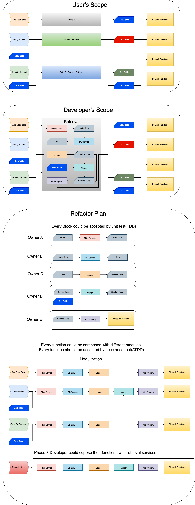

+ Retrieval Project
  + Preferences
    + LocalRetrievalPreferences
      + UserLoginPreference;
      + TracingRetrievalPreference;
    + GlobalRetrievalPreferences
      + DbConnectionPreferences
        + OracleDbPreference
        + TdvDbPreference
      + DisplayNamePreference
  + Containers
    + MetaInfo
    + Field
    + Filter
    + Query
    + Table
    + ...
  + Enumerates
    + DataCombinations
    + DataTypeOptions
    + JoinType
    + LoadLevel
    + TableFormat
    + DataIndex
    + ...
  + Tools
    + DataRetrievalTool
    + BringInDataRetrievalTool
    + DataOnDemandRetrievalTool
  + RetrievalForms
    + Forms
      + IRetrievalForm
      + DataRetrievalFrom
      + BringInDataRetrievalForm
      + DataOnDemandRetrievalForm
    + Controls
      + Components
        + IControl
        + UComboBox
        + UDropDownList
        + UListBox
        + ...
      + Models
        + IDataModel
        + DataCombinattionClassModel
        + DataCombinattionModel
        + DataType1Model
        + DataType2Model
        + LoadLevelModel
        + LotModel
        + ParameterModel
        + StatisticModel
        + TableFormatModel
        + WaferModel
        + ...
    + RetrievalSetting
      + IRetrievalSetting
      + RetrievalSettingFactory
      + DataRetrievalSetting
      + BringInDataRetrievalSetting
      + DataOnDemandRetirevalSetting
    + RetrievalFactory
